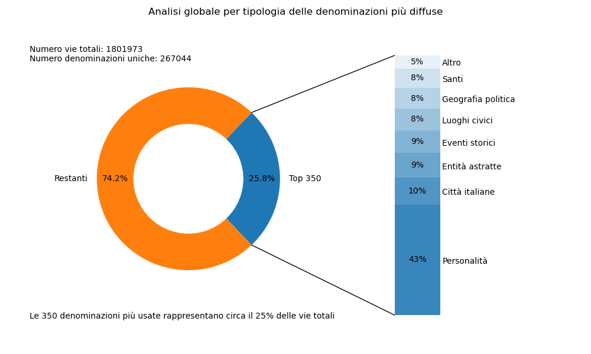

# Analisi Toponomastica
Ho analizzato le denominazioni di vie e piazze italiane con l'idea di estrapolarne informazioni statistiche globali e tendenze regionali.
Al di là delle classifiche delle vie più usate può essere interessante aggregare per tipologie di vie. Poichè non è possibile classificare automaticamente il nome di una via all'itenro di una data tipologia il lavoro è stato condotto per le 350 denominazioni più esate che ricoprono all'incirca un quarto delle totalità dei qusi due milioni di vie, piazze e corsi presenti sull territorio italiano.

