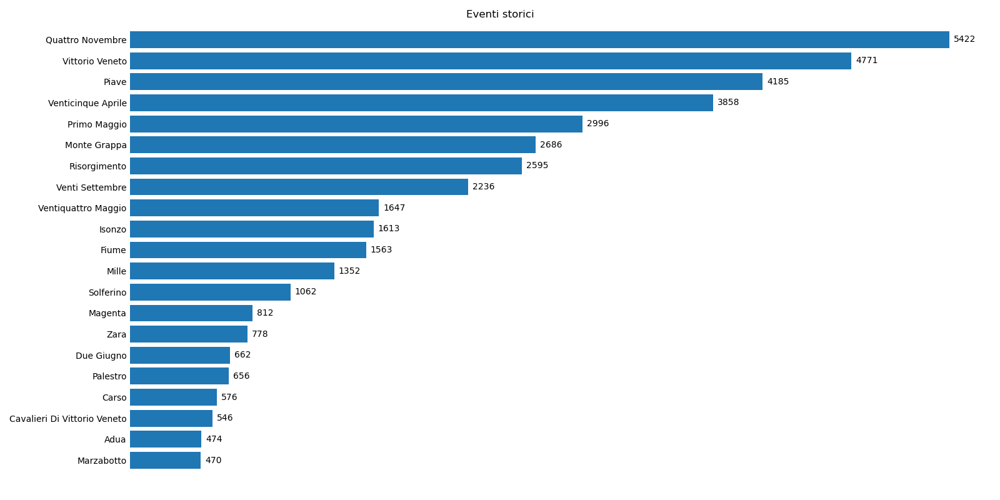

# Analisi Toponomastica
Ho analizzato le denominazioni di vie e piazze italiane (fonte: https://download.geofabrik.de/europe/italy.html) con l'idea di estrapolarne informazioni statistiche globali e tendenze regionali.
Al di là delle classifiche delle vie più usate può essere interessante aggregare per tipologie di vie. Poichè non è possibile classificare automaticamente il nome di una via all'iterno di una data tipologia il lavoro è stato condotto per le 350 denominazioni più esate che ricoprono all'incirca un quarto delle totalità dele circa 1 milione e 800 mila vie (piazze, corsi, ...) presenti sull territorio italiano.

Tra le personalità il podio spetta a Marconi, Garibialdi e Dante mentre tra gli Eventi Storici il Quattro Maggio è il più celebrato. La scelta delle categorie delle vie è stata arbitraria e non sembra nettamente definita: il Piave ad esempio è stato inserito negli Eventi Storici anzichè negli Elementi Geografici. San Francesco, San Rocco e San Martino sono i santi più popolari mentre tra le città Roma è di gran lunga quelle che riceve più dediche. 

La classifica delle Città ha ispirato una ricerca tra la correlazione tra le regioni. Ho misurato quanto un comune presente in una regione è predisposto a dedicare una sua via a una città presente nella propria regione piuttosto che in un altra. Si definisce quindi una metrica di correlazione che misura la percentuale di vie di una regione dedicate a città (comuni con più di 10 mila abitanti) di altre regioni (o della regione stessa).
Clusterizzando le regioni risulta che Val d'Aosta e Sardegna sono le più "isolate" rispetto alle altre regioni. Come ci si poteva aspettare ogni regione è più propoensa a dedicare vie alla proprie città ma tra tutte la Sicilia è la più autoreferenziale. Il Lazio e il Veneto sono le regioni che ricevono più dediche.

La parte più interessante è però, a mio parere, l'analisi per diffusione provinciale e regionele di certe tipologie di vie o, analogamente, quanto è poco diffuso una certo personaggio storiche in certe zone d'Italia. Poichè è poco sensato calcolare la diffusione relativa di una certa denominazione in una data provincia, dato che al massimo ogni comune può dedicare una via (o due se vi è anche una piazza) a un dato personaggio storico, ho fatto un'analisi in negativo. Ovvero, per ogni provincia, ho calcolato quanti sono in percentuale comuni che hanno dedicato almeno una via a quel dato personaggio storico.
Guardando ad esempio la mappa relativa a Giuseppe Garibaldi risulta poco popolare inaspettatamente in Piemonte e Liguria ma anche in Campania e Calabria dove invece me lo aspettavo.

Diversamente, se raggruppiamo più personaggi storici (o anche date ed eventi) sotto uno stesso tema (ad esempio Antifascismo e Resistenza) diventa significativo calcolare la percentuale di vie che, in ogni provincia, sono dedicate a quello specifico tema. Emergono quindi interessanti tendenze regionali, alcune attese, come ad esempio la poca diffusione di vie dedicate a santi nelle cosiddette regioni rosse dove invece primeggiano die dedicate al tema dell'Antifiscismo e Resistenza. Altre tendenze sono invece inaspettate, si veda ad esempio una spiccata popolarità della Basilicata per il Risorgimento

Concludo con una analisi globale della densità di vie per km quadrato e il numero totale di vie, sempre per provincia.

